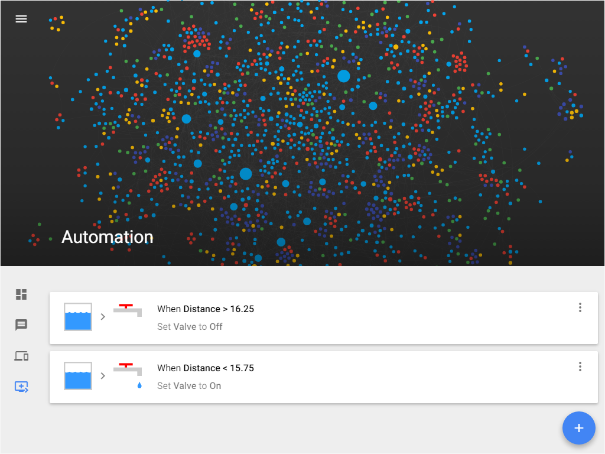

======

##### Hawpey: A Home Automation Web Protocol and Platform for Everything. Yay!

Hawpey is both a modern platform and protocol designed to be a universal interface for all of those random internet-connected devices in your home. It's only dependencies are Node.js and a file system, so it can run on Windows, Linux, and OS X.

:warning: Hawpey is still a work in progress and many new features will be coming soon.


### So yet another IoT framework?

Well, yes. However:
* Hawpey is built for the modern web. You can interact with it via websockets, and it has a nice RESTful API. It is also built on Node.js, with its plethora of libraries that you can use.
* The UI isn't too bad (what you think of it depends on how much you like Google's Material Design).
* It tries to be decentralized. That is, if one device goes offline devices that aren't dependent on the offline one will still work. For example, if the lights are set to turn on either when light switch A or light switch B is pressed, and light switch A goes offline, light switch B will still turn the lights on & off. The same goes for the device serving the website (basically each device controls its own automation).

### How does it work?

Hawpey first has some terms that it uses to standardize things:

1. Its network of internet-connected devices has two main types of servers:
  * A **master** serves the webpage, proxies all the devices into a single port, and manages other network-wide stuff (see more on this later)
  * **Devices** relay information from the outside world to the master and anything else connecting to them. They can also communicate with each other, so if the **master** goes down, everything won't completely failed
  * Note that these terms only relate to an instance of Node.js, so you could have multiple **devices** running on the same physical device or computer.
2. Each **device** runs a **program**, written in Node.js.
  * Programs can take in **variables** (like a JavaScript variable but able to be modified from outside). These make it easy to modify the way your program works on the go.
  * **Devices** can have **controls**. As the name implies, they control stuff, whether that be a lightbulb, your garage door, or even the contents of some file in your OS.
  * While **devices** can control their environment, they can also report things about it, in the form of **outputs**. An **output** could be the temperature of a room, the reading from some sensor, or whether it's cloudy outside.
    * With the exception of the APIS from inside a **program**, **controls** are also considered **outputs** as they have a state.
    * **Outputs** also have units to give them context.
3. **Devices** can report errors or debugging information through **logs**.
4. The **controls** of a **device** can be automated through **triggers**.
  * Triggers allow for **automation**. When an **output** of a device changes, a **control** of the same or different device can be changed.
5. In order to run a piece of code periodically, a **program** can define a **timer** than can be manually triggered. Think of them like `setInterval` calls, but better.
6. **Programs** can also **plot** the state of an **output** over time through **charts**.
7. In order to render the states of **outputs** and **controls** nicely in Hawpey's UI, each **device** must define a **format** file, which is a JSON document specifying icons, grouping of **outputs**, etc.

Now that's out of the way, here's a brief explanation of how everything fits together:
* When you run `device/server.js` (the code for **devices**), the **program** will be automatically required. Through the `hawpey-util` library, which every **program** must require, **outputs** and **controls** can be initialized then changed in response to events.
  * Once this happens, the program can create a **timer** to possibly poll sensors or other connected things or just listen for changes in the **controls** and act accordingly.
* When `master/program.js` runs (the code for the **master**) will create an HTTP(S) server to host the webpage. It will also listen for requests on `/proxy` and proxy the requests to the appropriate **device**.

## Getting Started

1. Clone the repo.
2. Install npm packages.
```bash
npm install
```
3. Initialize the files Hawpey populates.
```bash
npm run bootstrap
```
4. Edit the config files if you want (in `device/config` and `master/config`).
  * To use HTTPS:
    * Set `server.module` to `https`
    * Set `server.optionsSupplied` to `true`
    * Generate certificates. This can be done using something like the following:
```bash
openssl req -x509 -sha256 -newkey rsa:2048 -keyout device/private.key -out device/cert.crt -days 365 -nodes
```
    * If you're generating certificates for the master server, replace `device/private.key` and `device/cert.crt` with `master/private.key` and `master/cert.crt` respectively.
5. Start the device server. Resolve any port issues if you need to.
```bash
node device/server.js
```
6. Start the master server.
```bash
node master/server.js
```
7. Add the device to the master server by making a POST request to `host:port/devices`, where `host` and `port` are the respective hostname and port of the master. The `Content-Type` header must be set to `application/json` and the body should be like the following:
```json
  {
    "hostname:port": {
      "name": "test",
      "secure": true
    }
  }
```
  * `hostname:port` would be the address of the device you just created, the `name` property gives your device a nice name to be displayed, and `secure` specifies whether to connect to the device using HTTPS.
  * Hopefully this will be made simpler in future updates
  * If you're to lazy to do this you
8. Visit the address of the master in a web browser and you should see a couple sample outputs and the device displayed!

## Going Further

Now that Hawpey's set up, you can either browse the `Doc/` folder to read more about how Hawpey works or keep reading for some more tutorials on using Hawpey.

### Modifying a Program


To access the edit page, click the 3rd icon down in the side navigation bar or go to `/edit`, then click the name (or the circle above the name) of the device you want to edit.

Now we'll create our first program. First, delete everything in the text area on the left, then paste the code below:

```javascript
"use strict";

const h = require('./hawpey-util'); // We need this to change outputs & controls
exports.bridge = h.bridge; // This allows the device's main server to communicate with this program

h.v({ // First set up a variable
  "To print": {
    value: "Hello!",
    validator: /^[a-zA-Z!]*$/ // Allow the variable to only comprise of letters and an exclamation mark
  }
});
h.o({ // Create an output with units of in
      // notice the space, which will cause the output to display as "6 in" rather than "6in"
  "My first output": " in"
});
h.c({
  "My first control": {
    type: "boolean", // Controls can either be switches (booleans) or sliders (numbers)
    change: (newVal, oldVal) => { // This function is called when the control changes
      h.l.info(h.v("To print")); // Logs the value of the variable "To print"
      // You can also return a value to override the value the control was set to
    }
  }
});

const changeTimer = h.setTimer("Change Output", () => {
  h.o("My first output", Math.round(Math.random() * 10));
  h.plot("My first output"); // Add the output to a chart
}, h.t(0, 5));
```

Once you've pasted it, click the save button at the bottom. This should close the edit window.

Now go to the dashboard (first icon in sidenav or `/`) and turn the control on and off several times.

You should also notice the value of the only output change every 5 seconds to some new, random number, and can see the history of these changes by clicking the history icon to the left of the heart.

Then go to the log page (second icon or `/logs`). You should see the phrase `"Hello!"` outputted several times (however many times you changed the state of the output).

### Modifying Variables

Now we'll change the `To print` variable. As there is no UI for this yet, make an PUT request to `/variables/To%20print` with `Content-Type` of `application/json` and a body of the following:

```json
{
  "value": "Hello?"
}
```

Oh no! This should result in a `400` status code. Why? The validation regex for the function was set to not accept the exclamation mark, so follow the instructions above but instead use this body:

```json
{
  "value": "Hi!"
}
```

This time you should get a `204` code.

Now change the state of the control a few more times. The program should now log `Hi!` messages rather than `Hello!` ones every time the state of the control is changed.

### Creating a Trigger



Now that we have an output and a control to play with, we can create a trigger.

First, click the last icon in the side navigation or go to `/automation`.

To create a trigger, click the floating navigation button with a `+` symbol. Your cursor should move to a new code editor.

In that editor, replace everything with the following, replacing `hostname` and `port` with the hostname and port of the device:

```json
{
  "conditions": [
    {
      "type": "logic",
      "output": "\"hostname:port\".My first control",
      "condition": "> 7"
    }
  ],
  "results": [
    {
      "type": "control",
      "control": "\"hostname:port\".A control",
      "value": true
    }
  ]
}
```

Click save, then go back to the dashboard and turn the control off if it isn't already. Whenever the output reaches `8`, `9`, or `10`, the control should automatically switch off.

### Going Even Further

By now you're probably tired of reading documentation (if you didn't just skip to the end and start reading), so guess what? There's more!

Before setting anything else up, I'd highly recommend reading the files in the `Doc/` directory (you can also visit `/doc` on the master to view the same files).

## Contributing

If you encounter any errors following the steps above, have an idea for a feature, or find a bug, please either create an issue or submit a pull request. Thanks!

In order to rebuild the project, you'll need to have the dev dependencies installed. Then, run `gulp watch` to watch all files, or use `gulp <task>` to run a specific task.

## Todo

### To be implemented by `1.0.0`:
* **Connections**: being able to easily link other APIs to Hawpey through the master without creating a new device
* **Events**: An interface for devices to emit events that can be listened to through triggers and the websocket
* **Actions**: Sending messages to device in a trigger
* Support for the master to serve multiple ports and have authentication
* Showing charts in grouped outputs
* A UI for modifying variables and creating triggers without writing code
* Implement the rest of the trigger system
* Disabling triggers
* More tests (they are quite far behind)
